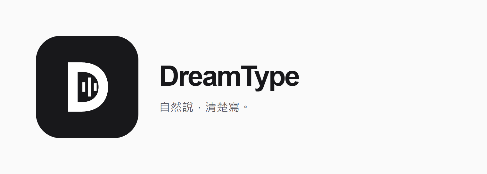

# DreamType



**自然說，清楚寫。** Android 語音鍵盤，使用家用主機的 AI 辨識並整理繁體中文。

[下載 Android APK](https://github.com/DreamOne09/DreamType/releases/latest/download/DreamType.apk) · [安裝步驟](docs/INSTALL.md) · [試用驗收與限制](docs/BETA_ACCEPTANCE.md)

> 0.7.0 封閉試用版：已加入帳號、個人設定同步、排隊與管理介面。尚未上架 Google Play 或收費。Android 原生操作仍待 Pixel 9 實機驗收。

## 0.7.0：資料保護與維運

加密结果可跨主機重啟取回；新版手機回報收件，未確認到期釋放額度。新增加密備份、每日備份／故障恢復排程、一次性密碼重設、管理操作紀錄及健康狀態。27 項後端測試通過；雲端備份、Pixel 9 實測與正式商店付款尚未完成。[操作與六項實際進度](docs/PRODUCTION_STATUS.md)。

## 0.6.0：兩輪修正

首頁簡化為三步引導，私人連線收進「帳號與連線」的進階選單。帳號模式會加密暫存一份未完成錄音，失敗時可按「重試上一段」，不立即要求重講；成功後清除。18 項後端測試、加密核心與 HTTPS 重試驗證通過，Android Keystore／Pixel 9 操作仍待實機驗收。[完整修正與限制](docs/TWO_ROUND_REVIEW.md)。

## 0.5.0 功能

斷線時重查結果，鍵盤「更多 → 取回上一筆」可在結果有效期間取回同帳號文字，不重送、不重扣。服務網址的 `/account` 可在沒有 App 時查用量或刪除線上帳號。另提供私人 SQLite 備份與新主機恢復工具。[操作、測試與限制](docs/RECOVERY.md)。

## 下載後怎麼用

**已收到試用邀請：** 安裝 APK → 開啟 DreamType → 登入管理者提供的服務網址、帳號與密碼 → 允許麥克風 → 啟用鍵盤。到記事本切換 DreamType，按「開始說話」，說完按「停止並整理」，確認後「插入文字」。

你只需要手機和網路，不必開自己的電腦。管理者的主機需保持開啟；目前沒有固定網域，臨時網址變更時需重新填網址並登入。GitHub 是下載程式的地方，不是 AI 服務網址，也不會自動提供帳號。

**原本使用私人金鑰：** 覆蓋安裝即可保留設定；首頁「帳號與連線 → 進階：私人電腦連線」仍可配對。不要把私人金鑰分享成多人帳號。新版與舊版套件、簽章相同，不必先刪除舊版。

## 這版能做什麼

- **簡單的語音鍵盤**：黑白介面、D 聲波圖示，主要按鈕依錄音／整理／插入狀態變化。
- **個人提示詞**：最多 2,000 字，可要求條列、語氣和排版；保留原意，不替你補寫沒說的需求。
- **台灣地名與常用詞**：縣市參考可開關，自訂詞庫最多 1,000 字；不保證同音字完全正確。
- **先修改再插入**：可用 Gboard 修改本次文字，再回原 App 插入；不替你傳送訊息。
- **帳號與換機**：受邀帳號登入後取回偏好，可查本月額度、修改密碼、登出及刪除帳號。
- **管理介面**：建立帳號、調整每月分鐘額度、停用帳號、查看排隊與用量。
- **更新檢查**：「我的設定」開啟 GitHub 新版 APK，由你確認安裝；不會自動升級後端。

私人金鑰模式的偏好只在手機，帳號模式的偏好存在主機並快取在手機。切换成帳號時載入該帳號偏好，不自動上傳舊私人設定。

## 主機第一次設定

目前支援 Windows x64 + NVIDIA CUDA，建議 8 GB 顯示記憶體、16 GB RAM、至少 15 GB 可用空間；先裝 Python 3.12 與 NVIDIA 驅動。其他硬體及乾淨 Windows 完整重裝尚未驗證。

下載 repo ZIP 解壓縮，或 git clone，在資料夾的 PowerShell 執行：

```powershell
powershell -ExecutionPolicy Bypass -File .\scripts\setup.ps1
powershell -ExecutionPolicy Bypass -File .\scripts\start.ps1
```

第一次下載數 GB 的模型與工具。開啟多人試用管理：

```powershell
.\work\venv\Scripts\python.exe .\scripts\admin.py
```

在私人管理入口按「連接管理服務」，建立試用帳號，再私下提供服務網址、帳號及初始密碼。不要分享 `work/admin-access.html`、`work/pairing.html` 或任何金鑰。停止服務使用 `scripts/stop.ps1`。

升級主機：先備份私有資料，再更新 repo 並重新啟動服務。執行 `work/venv/Scripts/python.exe outputs/local_voice/control.py restart` 只重啟模型與 API，保留現有通道；再次執行 start.ps1 可能重開通道並改網址。

## 怎麼運作與限制

Android 錄音 → HTTPS 通道 → 帳號驗證與排隊 → Whisper 辨識 → Qwen 整理 → 手機確認並插入。

- 目前全用主機上的模型，沒有付費 AI API；仍有電費、網路與維護成本。
- 手機可用行動網路並保留 Surfshark；錄音經 Cloudflare 代理，不是裝置間端對端加密。
- 最長兩分鐘一段；每帳號一筆未完成工作，服務最多八筆等待。成功才扣用量；處理失敗不扣。
- 草稿及伺服器結果為暫存，不能當成文件儲存工具；App 程序結束、結果過期或主機重啟可能無法取回。
- 同時 1／2／3 筆約 29 秒錄音已跑通；這不代表已確認長期容量。完整證據與手機驗收清單見 [BETA_ACCEPTANCE](docs/BETA_ACCEPTANCE.md)。

## 後續商店版

先由開發者家中電腦提供服务，未來可搬到 AI PC。推論轉接介面可替換，目前只實作本機供應者，沒有偷偷呼叫外部 API。Google Play 訂閱、付款驗證、固定入口、備援與正式上架仍未完成。

[家用部署決策](docs/HOME_SERVER.md) · [商店與多工具規劃](docs/STORE_ROADMAP.md) · [未來 API 成本研究](docs/CLOUD_COSTS.md)

## 開發與第三方元件

`outputs/android` 是原生 Java 鍵盤；`outputs/local_voice` 是 FastAPI、帳號資料庫與佇列；`scripts` 是安裝及管理工具。`work` 僅供本機私有資料，不纳入 Git。

後端測試：`work/venv/Scripts/python.exe -m unittest discover -s outputs/local_voice -p "test_*.py" -v`。

Android 建置：先 `python scripts/download_android_tools.py`，再 `python outputs/android/build.py`。自行建置會使用自己的簽章，無法覆蓋不同憑證的 APK；維護者必須保留原簽章材料。

採用 faster-whisper / CTranslate2、llama.cpp、Qwen、Whisper、FastAPI、OpenCC、Cloudflare Tunnel 和 Android SDK。模型與工具各遵循其授權，本 repo 不含模型權重與第三方二進位檔。DreamType 與 Typeless 無隸屬關係。
