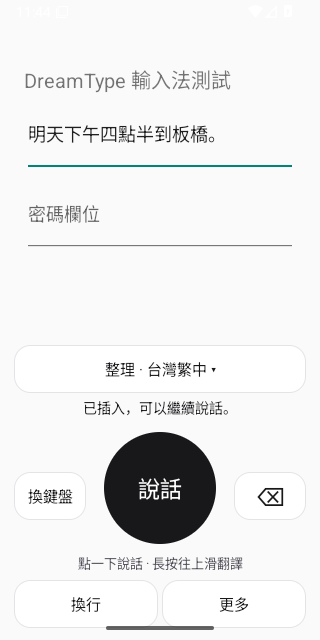
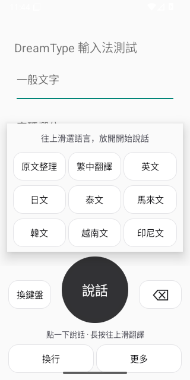

# 圓形語音鍵盤（0.9.7）

以台灣繁中為預設。參考 [Typeless 官方翻譯操作](https://www.typeless.com/help/quickstart/translate) 的長按上滑流程，採用 DreamType 自有黑白版面。

- 中央 112 dp 圓鈕：「說話」開始錄音，「停止」結束並送出；結果完成後變成「插入」。處理中停用按鈕，避免重複送出。
- 右側「⌫」直接退格：支援選取文字、游標前字元，按住連續刪除；手指移出按鈕或鍵盤收起就停止。
- 左側切換鍵盤，下方直接換行。
- 長按圓鈕，語言選單出現在上方；往上滑到目標語言，放開即開始錄音。選項會反白。不想錄音可放開在選項外；選單仍可直接點選。系統取消手勢或收起鍵盤會關閉選單。
- 上方語言按鈕仍可直接切換模式，保留不依賴手勢的入口。長按亦提供 Android 無障礙長按動作；TalkBack 實機尚待驗收。
- 錄音、處理、待插入或有保留錄音時，禁止切換語言，避免改變本段語音的目的。
- 台灣繁中整理、翻成台灣繁中、英文、日文、泰文、馬來文、韓文、越南文、印尼文。整理與翻成繁中是不同模式。

退格操作目前是外部 App 的標準 Backspace 按鍵事件；不同編輯器可能有不同的組字行為。待插入的辨識結果仍透過「修改文字」編輯。

本版也防止帳號／服務網址切換後，舊的登入、登出、設定同步或連線測試回覆覆蓋現在的手機設定。

## 驗證

APK 編譯、既有簽章驗證通過。七套 JVM 合約測試通過（不涵蓋原生手勢）。Android 16 原生模擬器 [執行 35798576123](https://github.com/DreamOne09/DreamType/actions/runs/35798576123)（來源 cba1a25）通過：

- 真實觸控點圓鈕錄音／停止、長按上滑選英文並開始翻譯模式錄音、回切中文模式。
- 刪除選取文字與 emoji、長按連刪；按鈕等寬高。
- 私人模式、模擬帳號模式、正式帳號 API／SQLite 隔離環境三條錄音及插入流程。AI 回傳固定文字；本輪沒有驗證 ASR／翻譯模型品質。
- 帳號回執、保留錄音清除、單次計費（正式 API 測試：3.008 秒音訊、計入 4 秒、一次 provider 呼叫）。
- 以 Android SharedPreferences／Keystore 驗證舊帳號／舊服務網址的寫入、登入替換、登出不能覆蓋現在狀態。並非真實延遲 HTTP 的同時點擊壓力測試。

前三輪修正了測試等待輸入框重建與 Android 選單文字無障礙節點不能直接點擊的問題；最終測試透過觸控事件執行，並保存明確斷言及 crash buffer 診斷。

Pixel 9 行動網路、不同 App 與 TalkBack 尚未驗收。

[原生結果](evidence/android-36-keyboard/ime-instrumentation.txt) · [正式 API 結果](evidence/android-36-keyboard/backend-ime-result.json)

## 0.9.7 之後的錄音設定保護（原始碼，尚未發布 APK）

錄音開始時保留不可變的 AppConfig，停止後使用同一份語言、個人偏好及連線設定。停止時與背景送出前核對登入金鑰、主機及授權模式；變更時拒絕送出並清除這次暫存音訊。進度回報、結果顯示及插入亦核對同一組連線身分，避免只比金鑰而漏掉主機變更。

這無法撤回已送出的 HTTP 請求；若送出後才換帳號，既有請求仍可能由原帳號完成，但新帳號畫面不接收它的結果。

七套 JVM 合約測試通過，新增檢查偏好變更不改動既有 AppConfig、同金鑰不同主機／不同授權模式不能視為同一登入。Android 16 原生回歸 [35799359269](https://github.com/DreamOne09/DreamType/actions/runs/35799359269)（來源 bf056e2）通過私人、帳號及正式 API 隔離環境三條既有鍵盤流程，[正式 API 結果](evidence/android-36-recording-session/backend-ime-result.json)已保存；尚未用原生實機模擬「錄音期間外部同步設定」的競爭情境。
