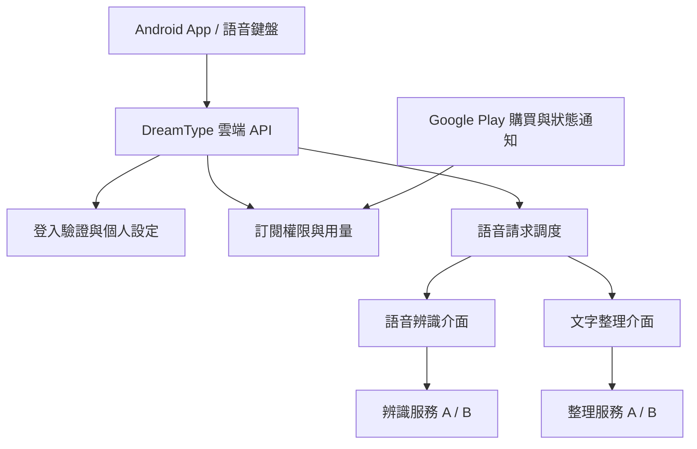

# 商店版與多工具整合規劃

> 2026-09-21 最新部署決定：先由開發者家中的電腦提供遠端 AI 服務，未來再搬到 AI PC。本文的「雲端服務」指使用者透過網路存取的服務，不再預設採用外部付費 AI API。使用者不必開自己的電腦；開發者的主機仍需運行。詳見 [最新部署決策](HOME_SERVER.md)。

更新日期：2026-09-21。0.4.0 已實作家用主機上的邀請帳號、偏好、佇列與額度；本文件其他商店流程仍為規劃，詳見 [驗收狀態](BETA_ACCEPTANCE.md)。

2026-09-21 補充：[工具選擇與成本試算](CLOUD_COSTS.md) 已提出三組候選方案與可重算公式，尚未選定正式供應商或售價。

## 已確認的產品方向

- 以 Google Play 上架為目標，先服務 Android 使用者。
- 像 Typeless 的使用方式：下載、登入、選擇方案、啟用語音鍵盤，即可使用；不必開自己的電腦。
- 提供登入與付費機制，個人提示詞與詞庫歸屬於個人帳號。
- 保留整合兩到三個工具／服務的彈性，未來能替換、比較或增加供應商。
- 介面維持簡單直觀；一般使用者不需要知道背後的模型、API 金鑰與服務路由。
- 現階段已推進本機封閉試用實作；不新增真實收費、不購買外部 AI API。

「兩到三個工具」目前先定義為可替換的服務或功能模組；尚未指定是哪幾個產品。如果後續包含外部 App 操作或其他工作流程，另行定義其介面及權限，不預設加入。

## 現況與目標分開

| 項目 | 目前 0.4.0 試用版 | 商店版目標 |
|---|---|---|
| 語音處理 | 管理者的 Windows NVIDIA 電腦 | 我們提供的雲端服務 |
| 使用者識別 | 邀請帳號與七天登入；私人金鑰模式另保留 | 經驗證的使用者帳號 |
| 提示詞／詞庫 | 帳號偏好可取回，手機保留快取 | 帳號隔離，可在換機後恢復 |
| 付費 | 沒有付款／訂閱 | Google Play 訂閱與伺服器驗證權限 |
| 更新 | GitHub APK 下載更新 | Play 商店更新；GitHub 版另行維護 |
| 使用入口 | 手動輸入臨時網址並登入 | 登入後直接使用 |
| AI 工具 | faster-whisper + llama.cpp/Qwen 本機實作 | 可替換的辨識與文字整理服務 |

上架本身不代表每個 App 都必須登入；本產品選擇帳號，是為了雲端權限、用量管理及個人設定。既有 APK 不應被描述成已完成商店版。

## 使用者看到的流程

1. 安裝 DreamType，登入帳號。
2. 查看試用或付費方案，以及包含的用量。方案與價格尚未決定。
3. 啟用鍵盤、允許麥克風。
4. 說話 → 整理 → 確認／修改 → 插入文字。
5. 「我的設定」管理個人提示詞、詞庫、方案、用量、帳號與刪除請求。

登入、購買、個人設定放在 App 頁面；鍵盤維持錄音與文字結果的簡單操作。帳號頁提供管理訂閱入口，清楚區分刪除帳號與取消訂閱的效果。

## 可替換的模組

以介面分離責任，第一版不必同時串好所有服務：

| 模組 | 負責什麼 | 預留替換方式 |
|---|---|---|
| 身分驗證 | 驗證登入憑證，產生內部 user_id | 隔離登入供應商與核心使用者資料 |
| 語音辨識 | 音訊 → 原始文字、語言、處理時間 | SpeechProvider 介面，接自架引擎或外部 API |
| 文字整理 | 原始文字 + 個人偏好 → 整理結果 | TextProvider 介面，接不同模型／API |
| 服務選擇 | 選主服務、處理故障、記錄版本與耗時 | 由伺服器設定決定，不硬寫在 APK |
| 訂閱權限 | 驗證購買、恢復購買、更新到期／退款狀態 | 以 EntitlementService 隔離 Play Billing 與業務邏輯 |
| 用量 | 額度預留、成功結算、失敗釋放 | 獨立帳本，與某一家模型計價方式分離 |

建議的接法是先上一組主服務，再加第二家作比較／備援，必要時增加第三個模組。不是把每段錄音同時送給三家：這會重複花錢，也擴大錄音傳送範圍。

## 介面契約草案

以下是設計草案，不是目前已存在的公開端點：

- `GET /v2/me`：帳號、方案與剩餘用量。
- `GET/PATCH /v2/me/preferences`：個人提示詞、詞庫、台灣地名偏好。
- `POST /v2/dictations`：音訊、語言、偏好版本與 idempotency key；回傳請求 ID、狀態與結果。
- `GET /v2/dictations/{id}`：查詢自己尚在處理的請求，避免網路逾時後重複上傳／重複扣額度。
- `POST /v2/billing/google/verify`：使用者登入後提交購買 token，由伺服器向 Google 查驗，不信任 App 自報「已付款」。
- `POST /v2/me/deletion-request`：提出帳號及相關資料刪除請求；另提供商店政策要求的網頁入口。

核心介面只回傳標準化結果。供應商錯誤格式、SDK 物件及密鑰不外洩到手機；提供者名稱與模型版本可在內部追蹤，不寫入包含完整錄音／文字的日誌。

## 多工具整合必須保持的行為

- 身分與資料隔離：伺服器從已驗證的登入憑證取得 user_id，不接受客戶端任意指定其他人的帳號；查詢請求、詞庫與提示詞都要檢查擁有者。
- 每次錄音固定一份偏好快照，切換工具也使用同一份，避免中途修改造成不一致。
- 限制每段音訊長度、大小、併發數與帳號額度。尚未定價前不承諾不限量。
- 用相同 request ID 追蹤重試與扣量；不能因逾時、通知重複或備援切換而重複扣用戶額度。
- 錯誤要分類：暫時無法服務可考慮備援；無權限、無額度或無效音訊不應盲目重試。
- 文字整理失败可回傳已辨識的原文並顯示提示；保留「不新增事實、不替使用者送出訊息」的原則。
- 備援服務只能選用已列入資料處理說明、設定允許的供應商；不悄悄把錄音轉送到未揭露服務。
- 錄音及暫存結果的保存時間、刪除與故障恢復政策必須先明確定義，不預設永久保存。

## 登入、付款與上架

### 登入

封閉試用先使用邀請帳號與 PBKDF2 密碼雜湊；商店版仍可評估 Google 登入，尚未選定。無論使用 Firebase Auth、其他託管服務或自建方案，後端都必須驗證 token 的簽發者、對象、有效期，並映射到自己的 user_id。App 上顯示登入畫面不等於帳號系統完成。

個人設定資料可換機恢復。現有「每支手機設定」遷移時，需要讓使用者確認要上傳哪些提示詞／詞庫；不能把所有手機共用同一把服務金鑰當成登入。

### 付款

Android 商店版預設採 Google Play Billing，銷售 App 內數位功能／雲端服務；特定地區與方案的例外規則在實際發布前再核對，不先加入外部付款引導。

App 發起購買，後端驗證後才授予權限。處理 pending、購買確認、續訂、寬限期、付款保留、取消、到期與退款；取消自動續訂不等於立即取消已付費期間。重複通知必須可安全重放，恢復購買不能讓同一筆購買任意綁定多個帳號。

可評估直接整合 Play Billing，或用訂閱管理服務協助處理；尚未決定是否採用第三方付費管理工具。這些工具不取代 Google Play 的支付規則，也不取代我們的用量管理。

### 商店準備

- 建立／確認 Play Console 帳號、身份驗證及商家資料；帳號狀態尚待使用者提供。
- 商店版需要 AAB 建置與 Play App Signing 規劃。現有手工 APK 建置流程須擴充或遷移；保留現有簽章材料，先確認側載版到商店版的套件與簽章相容策略。
- 商店版本使用 Play 更新流程；不能直接沿用引導下載 GitHub APK 的更新入口。GitHub 試用版本可維持獨立發行方式。
- 提供隱私權政策、Data safety、麥克風／錄音資料處理說明、帳號刪除入口與審查用存取方式。
- 若屬政策涵蓋的新個人開發者帳號，現行要求為至少 12 名測試者連續加入封閉測試 14 天，再申請正式發布資格；不是滿天數就自動上架。

## 開發順序與驗收

1. **選定服務與成本上限**：確定主辨識／整理工具，保留第二個介面實作；用相同台灣中文音訊比較地名、人名、自我修正、延遲和費用。不要將目前單人本機速度當成雲端多人保證。
2. **雲端 API 與帳號**：登入驗證、個人資料隔離、可替換 AI 介面、額度帳本；先接測試服務，驗證不同帳號不能互讀資料。
3. **購買測試**：建立測試訂閱，驗證購買、恢復、退款、到期和重複通知；付款狀態與用量不一致時有可追查的處理方式。
4. **商店介面與封閉測試**：登入／方案頁、簡單的語音鍵盤、真實裝置和行動網路测试、必要的上架文件。
5. **擴充第二／第三工具**：在共同介面下驗證備援、錯誤分類與重試，確認不重複扣額度，再逐步開放。

月營運成本至少包含辨識、文字整理、伺服器、資料儲存與流量、訂閱工具（若有）、Google Play 服務費及支援成本。供應商、目標用量、售價及可接受毛利尚未決定，因此本文件不承諾價格或上線日期。

## 待決事項

- 實際要整合的兩到三個工具／服務，以及哪個先做主服務。
- Google Play 開發者帳號類型與狀態。
- 登入供應商、雲端部署位置、資料保存期限。
- 免費試用額度、月／年方案、超量處理與價格。
- 商店版與現有本機版的套件／簽章及維護安排。

## 官方依據

- [Google Play Payments policy](https://support.google.com/googleplay/android-developer/answer/9858738?hl=en)：App 內數位功能與服務付款原則及例外。
- [Play Billing integration](https://developer.android.com/google/play/billing/integrate)：購買流程與權限处理。
- [Real-time developer notifications](https://developer.android.com/google/play/billing/rtdn-reference)：收到通知後查詢完整購買狀態。
- [Account deletion requirements](https://support.google.com/googleplay/android-developer/answer/13327111?hl=en)：有 App 內建帳號建立流程時的刪除要求。
- [New personal account testing requirements](https://support.google.com/googleplay/android-developer/answer/14151465?hl=en)：適用帳號的封閉測試要求。
- [Publish your app](https://developer.android.com/studio/publish)：新 App 的 Android App Bundle 發布流程。
- [Use Play App Signing](https://support.google.com/googleplay/android-developer/answer/9842756?hl=en)：簽章與跨發行管道安排。
- [Device and network abuse](https://support.google.com/googleplay/android-developer/answer/16559646?hl=en-GB)：Play 發行版本的更新機制要求。

政策會變更，正式實作／送審前需重新查核。現有功能狀態請看 [STATUS.md](STATUS.md)，不以本規劃文件當作完成證明。
